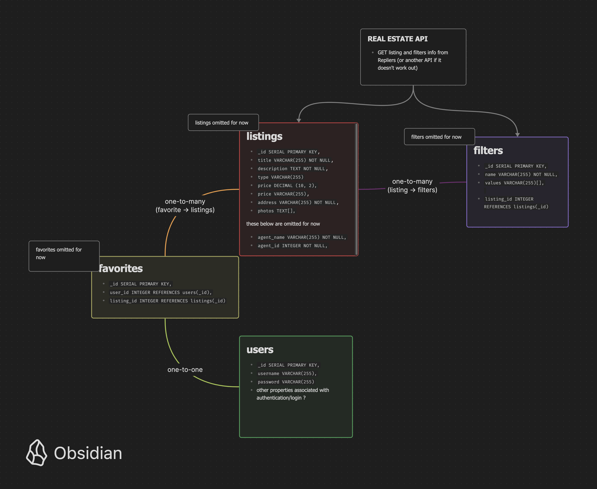

# Group-Scratch-Project

Junior phase group scratch project

## Description

As a team of 4, we worked to develop a full-stack real-estate search application. GPREB is designed to give users access to a realtime nationwide search engine. GPREB authenticates it's users, pulls real-time data, and allows the user to filter by a variety of fields, securely and efficiently.


## Getting Started

### Dependencies

  Use ```npm install``` to add all dependencies

### Installing

1. Fork and clone from origin/main repository on GitHub
2. Clone URL onto your local device
3. Open repository in your preferred editor

### Executing program

   Run visuals  ```npm run dev```.  
   Run server and visuals ```npm run devserver```.  
   Navigate to 'localhost: 8080' in your browser.

## Tech

-react, express, SQL, HTML, SCSS

We are using the 'Realty in US' api on RapidAPI to get real estate listings.

## Future Iterations

-DB is already setup for future extensions  
-User ability to drag and drop favorites  
-GeoJSON mapping that allows user to set search area  



## Help

-Use of DB functionality will require future users to setup their own SQL DB instance, OR contact the previous iterator for access to the original database (which is hosted on Supabase).  
-API


## Authors

## Jeremiah Hogue
https://github.com/NotHogue

## Tristan Keester
https://github.com/Ronagens

## Grant Schussler
https://github.com/gschussler

## Chad DeGange 
https://github.com/cdegange

